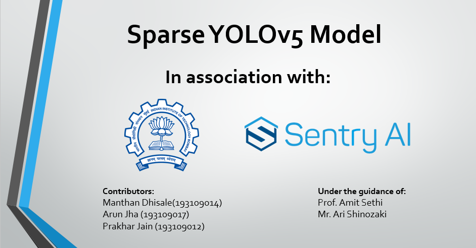

# Sparse YOLOv5 Model- In colaboration with IIT Bombay and Smart Sentry.ai

This repository is a Sparse YOLOv5 model developed to make existing YOLOv5 model more efficient in terms of memory and computation speed. This repository can either be cloned/downloaded in your local machine/edge computer OR a tutorial.ibnpy Google Colab version of this model can be run in.

## Abstract
Edge computing presents a good alternative to cloud computing in context of issues such as latency and increased process times. These devices are present closer to the application points such as surveillance through UAV's (Unmanned Aerial Vehicles), security cameras, etc. However, its applications are limited because of the memory constraints and computing power available on board. Though there have been development of GPU based Edge Computers like NVIDIA Jetson or Google Coral Edge TPU, still the prices are high. It might not always be a feasible solution to run a memory intensive Deep Learning model on these devices for small-scale non-industrial applications.  Convolutional Neural Network, CNN based object detectors such as YOLO series models which provide good object detection accuracies with high speeds. However, the inference of these models is still high for edge applications such as security surveillance platforms and hence the number of trainable parameters has to be reduced without affecting its accuracy. The present report explains an attempt of development of a less memory intensive, low computing power demanding Sparse YOLOv5 model, which is a modification to the existing YOLOv5. This model helps the user control the sparsity threshold of the neural nets present in the YOLOv5 model, thus reducing the inference time at the cost of reduced accuracy. The report also explains an optimal sparsity index based on the experimentation, which can be followed by the users for object detection applications without significant decrease in the accuracy but with a satisfactory time-boost.

## Team Members
- [Manthan Dhisale](https://github.com/ManthanND) *(Team Lead)* 
- [Varad Mane](https://github.com/vrdmn7721)
- [Sumit Sureka](https://github.com/sumitrock5)
- [Prashant Shettigar](https://github.com/prashants31)
- [Yashwardhan Bahure](https://github.com/yash-217)

